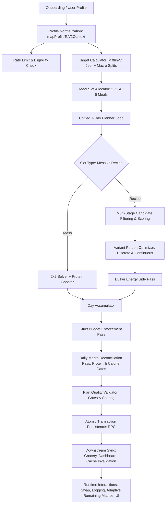

# GrindLog Nutrition V2 — Current Flow Audit & Architecture Specification
**Generated:** 2026-10-06  
**Status:** AUDIT ONLY (Behavior preserved, V2 disabled globally)  
**Scope:** Authoritative trace of all 34 steps from onboarding inputs to UI rendering.

---

## 1. Executive Summary & Flow Overview

This document presents an exhaustive, line-by-line audit of the production implementation of **GrindLog Nutrition Engine V2**. The system operates on a deterministic, constraint-satisfaction paradigm designed to synthesize 7-day personalized meal plans across diverse Indian dietary preferences, cooking environments, equipment access, and budgetary restrictions.

### Architectural Path

---

## 2. Comprehensive 34-Step Audit Trace

---

### Step 1: Onboarding / Profile Fields
- **Source File / Function:**  
  `types/fitness/onboarding.ts` (`OnboardingSchema`, `getOnboardingCompletionIssues`), `supabase/migrations/20261002_02_meal_templates_and_profiles.sql` (schema alterations to `fitness_os_profiles`).
- **Input Fields:**  
  `age`, `gender`, `height`, `weight`, `target_weight`, `goal`, `fitness_level`, `activity_level`, `food_type`, `food_environment`, `meals_per_day`, `nutrition_budget`, `available_equipment`, `mess_available`, `mess_meals`, `mess_included_in_budget`, `available_foods`, `food_allergies`, `foods_disliked`, `foods_avoided`, `workout_time`, `wake_time`, `sleep_time`, `timezone`.
- **Output:**  
  Validated `OnboardingData` object persisted to the `fitness_os_profiles` PostgreSQL table.
- **Fallback Behavior:**  
  `getOnboardingCompletionIssues` requires critical personal profile, biometrics, diet, and budget before submission. Optional fields (`foods_disliked`, `food_allergies`, `available_equipment`) default to empty arrays/null.
- **Validation:**  
  Zod schema validation bounds `age` [16, 120], `height` [50, 300], `weight` [30, 400], and enforces strict enum sets.
- **Possible Failure Modes:**  
  Mismatch between onboarding UI choice strings and planner expectations (e.g. `activity_level` stores `"Mostly sitting"`, whereas planner expects `"sedentary"`; `mess_available` is not collected during onboarding UI and is null in database for fresh signups).

---

### Step 2: Profile Normalization
- **Source File / Function:**  
  `lib/services/nutrition/v2-plan-service.ts` (`V2PlanService.mapProfileToV2Context`)
- **Input Fields:**  
  Raw database row from `fitness_os_profiles`.
- **Output:**  
  Strongly-typed `UserPlanningProfile` (defined in `lib/fitness/nutrition/domain-types.ts`).
- **Fallback Behavior:**  
  - Diet defaults to `"vegetarian"` if unrecognized.
  - Environment defaults to `"Home"` if empty.
  - Meals per day defaults to `3`.
  - Monthly budget defaults to `4500` if null.
  - If `available_equipment` is null/empty and environment is Hostel/PG, injects `["kettle"]`; otherwise injects `["stove", "blender"]`.
  - If `mess_available` is null/undefined, automatically infers `true` if environment is `"Hostel"`, `"PG"`, or `"Office/Canteen"`.
- **Validation:**  
  Checks required fields in `generateV2MealPlan` (`height`, `weight`, `food_type`, `meals_per_day`, `nutrition_budget`); throws `PROFILE_INCOMPLETE` if any are missing.
- **Possible Failure Modes:**  
  Auto-inferring `mess_available = true` for PG/Hostel users when they did not opt into a mess or cook for themselves, causing 3 mess meals to be forcibly generated per day.

---

### Step 3: Eligibility Checks
- **Source File / Function:**  
  `lib/services/nutrition/nutrition-service.ts` (`NutritionService.getWeeklyPlanEligibility`) via `v2-plan-service.ts:318-322`.
- **Input Fields:**  
  `userId`, `options.forceV2`.
- **Output:**  
  `{ can_generate: boolean, reason?: string, next_eligible_date?: string }`.
- **Fallback Behavior:**  
  Admins or development environments can bypass rate limiting with `options.forceV2 = true`.
- **Validation:**  
  Queries `meal_plans` table for plans created within the last 7 calendar days.
- **Possible Failure Modes:**  
  Users attempting to re-generate mid-week are blocked unless an active plan has expired. Also, if any meal in the target 7-day range has status `LOGGED`, plan regeneration is hard-aborted to protect historical data integrity.

---

### Step 4: BMR Calculation
- **Source File / Function:**  
  `lib/fitness/nutrition/unified-7day-planner.ts` (`calculateDailyTargets`, lines 81–90).
- **Input Fields:**  
  `weightKg`, `heightCm`, `age`, `gender`.
- **Output:**  
  Basal Metabolic Rate in kcal (number).
- **Fallback Behavior:**  
  Defaults: `weightKg || 70`, `heightCm || 175`, `age || 25`, `gender || "male"`.
- **Formula:**  
  Mifflin-St Jeor:  
  $$\text{BMR} = 10 \times \text{weight} + 6.25 \times \text{height} - 5 \times \text{age} + s$$  
  where $s = -161$ if `gender.toLowerCase() === "female"`, else $s = +5$.
- **Validation:**  
  Guarantees non-negative integer.
- **Possible Failure Modes:**  
  Profiles with `gender = "Other"` or `"Prefer not to say"` receive the male formula ($+5$) rather than a neutral or female baseline.

---

### Step 5: TDEE Calculation
- **Source File / Function:**  
  `lib/fitness/nutrition/unified-7day-planner.ts` (`calculateDailyTargets`, lines 92–100).
- **Input Fields:**  
  `bmr`, `activityLevel`.
- **Output:**  
  Total Daily Energy Expenditure (kcal): $\text{TDEE} = \text{round}(\text{BMR} \times \text{multiplier})$.
- **Fallback Behavior:**  
  Default multiplier is `1.375`.
- **Branches:**  
  - `act.includes("sedentary")`: $1.2$
  - `act.includes("light")`: $1.375$
  - `act.includes("moderate")`: $1.55$
  - `act.includes("very") || act.includes("heavy") || act.includes("athlete")`: $1.725$
- **Validation:**  
  Result is rounded to nearest integer.
- **Possible Failure Modes:**  
  **String Mismatch Bug:** Onboarding saves `"Mostly sitting"`. Since `"mostly sitting"` does not contain `"sedentary"`, it falls through and receives `1.375` (overestimating sedentary energy burn by ~14.5%).

---

### Step 6: Calorie Target
- **Source File / Function:**  
  `lib/fitness/nutrition/unified-7day-planner.ts` (`calculateDailyTargets`, lines 102–109).
- **Input Fields:**  
  `tdee`, `goal`.
- **Output:**  
  `targetCalories` (kcal).
- **Fallback Behavior:**  
  Default adjustment is $0$ (maintenance: `targetCalories = tdee`).
- **Goal Offsets:**  
  - `lose | cut | fat`: $\max(1300, \text{round}(\text{tdee} - 450))$
  - `gain | bulk | muscle`: $\text{round}(\text{tdee} + 350)$
- **Validation:**  
  Lower safety bound clamped at $1300\text{ kcal}$.
- **Possible Failure Modes:**  
  Goals like `"Build Strength"` or `"Improve Fitness"` fall through to $0$ offset (maintenance) instead of structured strength/hypertrophy surplus (+200 kcal).

---

### Step 7: Protein / Carb / Fat Targets
- **Source File / Function:**  
  `lib/fitness/nutrition/unified-7day-planner.ts` (`calculateDailyTargets`, lines 111–133).
- **Input Fields:**  
  `weightKg`, `goal`, `activityLevel`, `targetCalories`.
- **Output:**  
  `{ calories, protein, carbs, fat }`.
- **Rules:**  
  - Protein factor: $2.0\text{ g/kg}$ if `gain | bulk | athlete | lose | cut`; $1.4\text{ g/kg}$ if `sedentary`; default $1.8\text{ g/kg}$.
  - Target Protein: $\text{round}(\text{weight} \times \text{proteinFactor})$.
  - Target Fat: $\text{round}((\text{targetCalories} \times 0.25) / 9)$ (25% caloric share).
  - Target Carbs: $\max(0, \text{round}((\text{targetCalories} - (\text{protein} \times 4 + \text{fat} \times 9)) / 4))$.
- **Validation:**  
  Carbohydrates strictly clamped at $\ge 0$.
- **Possible Failure Modes:**  
  In very aggressive cuts with high body weights, protein + fat calories can exhaust total calories, forcing carbs to 0g (ketogenic collapse) without an explicit keto preference.

---

### Step 8: meals_per_day Handling
- **Source File / Function:**  
  `lib/services/nutrition/v2-plan-service.ts:189-195` and `unified-7day-planner.ts:138-145`.
- **Input Fields:**  
  `profile.meals_per_day` (e.g. `"2 meals"`, `"3 meals"`, `"4 meals"`, `"5+ meals"`).
- **Output:**  
  Integer `mealsPerDay` clamped to $[2, 5]$.
- **Fallback Behavior:**  
  Defaults to `3` if unparseable or out of bounds.
- **Validation:**  
  `Math.max(2, Math.min(5, mealsPerDay || 3))`.
- **Possible Failure Modes:**  
  None identified; handles `"2"`, `"3"`, `"4"`, `"5+"` cleanly.

---

### Step 9: Meal-Slot Allocation
- **Source File / Function:**  
  `lib/fitness/nutrition/unified-7day-planner.ts` (`calculateSlotAllocations`, lines 138–285).
- **Input Fields:**  
  `dailyTargets`, `mealsPerDay`, `wakeTime`, `sleepTime`.
- **Output:**  
  Array of `MealSlotAllocation`:  
  - **2 meals:** Lunch (50%), Dinner (50%).
  - **3 meals:** Breakfast (30% cal / 28% P), Lunch (38% cal / 38% P), Dinner (32% cal / 34% P).
  - **4 meals:** Breakfast (25%), Lunch (35%), Snack (15%), Dinner (25%).
  - **5 meals:** Breakfast (22%), Lunch (30%), Snack (15%), Dinner (25%), Post-Workout (8%).
- **Fallback Behavior:**  
  Uses standard Indian meal timings: 08:30 (Breakfast), 13:00 (Lunch), 17:00 (Snack), 20:30 (Dinner).
- **Validation:**  
  Percentages sum to 100% within integer rounding tolerance ($\pm 1\text{ kcal}$).
- **Possible Failure Modes:**  
  If workout time is scheduled in the morning, 5-meal post-workout is still placed at 21:30 (fixed static time array).

---

### Step 10: Diet Filtering
- **Source File / Function:**  
  `lib/fitness/nutrition/candidate-generator.ts:165-176`.
- **Input Fields:**  
  `profile.dietPreference`, `recipeVersion.dietCategory`, `recipeVersion.compatibleDiets`.
- **Output:**  
  Boolean keep/reject candidate decision.
- **Rules:**  
  - `vegan`: strictly requires `rv.dietCategory === "vegan"`.
  - `vegetarian`: accepts `["vegan", "vegetarian"]`.
  - `eggetarian`: accepts `["vegan", "vegetarian", "eggetarian"]`.
  - `non-veg`: accepts all diet categories.
- **Validation:**  
  Hard filtering; rejected recipes are never considered for the candidate pool.
- **Possible Failure Modes:**  
  If a vegetarian recipe is tagged `"eggetarian"` accidentally in seed data, it is excluded from vegetarian plans.

---

### Step 11: Allergy Filtering
- **Source File / Function:**  
  `lib/fitness/nutrition/candidate-generator.ts:178-193`, `lib/fitness/nutrition/domain-types.ts:matchesAllergen`.
- **Input Fields:**  
  `profile.allergies`, food catalog ingredient allergens.
- **Output:**  
  Boolean exclusion; any variant containing a matching allergen is discarded.
- **Synonym Coverage:**  
  Includes `dairy` (milk, curd, paneer, whey, ghee, cheese, yogurt), `gluten` (wheat, roti, maida, bread, pasta, semolina), `peanuts`, `tree_nuts`, `soy`, `eggs`, `fish`, `shellfish`.
- **Validation:**  
  100% zero-tolerance hard gate in `plan-quality-validator.ts:140`.
- **Possible Failure Modes:**  
  Free-text allergy input from user (e.g. `"mushroom"`, `"sesame"`) that is not listed in `matchesAllergen` taxonomy can leak if not matched via string substring.

---

### Step 12: Disliked / Avoided Food Filtering
- **Source File / Function:**  
  `lib/fitness/nutrition/candidate-generator.ts:196-214`.
- **Input Fields:**  
  `profile.dislikedFoods`, `profile.avoidedFoods`.
- **Output:**  
  Hard candidate rejection if any variant ingredient contains any avoided/disliked food string.
- **Validation:**  
  Case-insensitive substring match across `ing.foodName`.
- **Possible Failure Modes:**  
  **Over-Filtering Conflict:** Disliked foods are treated as **hard rejection** rather than a scoring penalty. If a user enters multiple common staples in dislikes (e.g. `"dal"`, `"paneer"`, `"rice"`), candidate pool can become empty, throwing `Unable to generate meal for slot`.

---

### Step 13: Environment Filtering
- **Source File / Function:**  
  `lib/fitness/nutrition/candidate-generator.ts:217-226`.
- **Input Fields:**  
  `profile.foodEnvironment`, `recipeVersion.supportedEnvironments`.
- **Output:**  
  Exclusion of recipes unsupported in the user's environment.
- **Rules:**  
  If user is in `"Hostel"`, `"PG"`, or `"Office/Canteen"`, only recipes explicitly supporting those environments are allowed.
- **Possible Failure Modes:**  
  Recipes lacking `"Hostel"` or `"PG"` in `supported_environments` are omitted even if they require only a kettle or no cooking.

---

### Step 14: Equipment Filtering
- **Source File / Function:**  
  `lib/fitness/nutrition/candidate-generator.ts:228-236`.
- **Input Fields:**  
  `profile.availableEquipment`, `recipeVersion.requiredEquipment`.
- **Output:**  
  Exclusion of recipes requiring unavailable equipment.
- **Rules:**  
  Recipe is cookable if `requiredEquipment` is empty, contains `"none"`, or has at least one equipment owned by user.
- **Possible Failure Modes:**  
  If a recipe requires BOTH a stove AND a blender (e.g. puree then cook), `some()` satisfies if the user has only a stove, leading to uncookable blender recipes for stove-only users.

---

### Step 15: Mess Handling
- **Source File / Function:**  
  `lib/fitness/nutrition/unified-7day-planner.ts:549-840`.
- **Input Fields:**  
  `profile.messAvailable`, `profile.messMeals`, `alloc.slot`.
- **Output:**  
  Template-based mess meal containing ₹0 mess staples (Dal, Sabzi, Rice/Phulka) and an optimized Protein Booster (Paneer, Curd, Sprouts, Chana, or Eggs).
- **Solver:**  
  2x2 system of linear equations solving for staple carbs ($s$) and protein booster ($b$) to match slot calories and protein exactly.
- **Validation:**  
  Bounded portion grid search ($b \in [b_{\min}, b_{\max}]$, $s \in [s_{\min}, s_{\max}]$) minimizing quadratic deviation penalty.
- **Possible Failure Modes:**  
  If `mess_meals` is misconfigured or empty, fallback triggers standard recipes which may violate PG/Hostel equipment limitations.

---

### Step 16: Pantry Handling
- **Source File / Function:**  
  `lib/fitness/nutrition/candidate-generator.ts:360-368`, `v2-plan-service.ts:956-1000`.
- **Input Fields:**  
  `profile.availableFoods` / `available_foods`.
- **Output:**  
  Candidate score bonus (+5 pts per matching pantry item) and tagging in the smart grocery list (`alreadyHave` section).
- **Validation:**  
  Case-insensitive substring match.
- **Possible Failure Modes:**  
  Plural forms (e.g. user entered `"eggs"`, recipe ingredient is `"egg"`) require bi-directional substring matching.

---

### Step 17: Budget Handling
- **Source File / Function:**  
  `lib/fitness/nutrition/candidate-generator.ts:259-283, 332-358`, `unified-7day-planner.ts:500-520, 1107-1219`.
- **Input Fields:**  
  `profile.budgetPolicy` (`"STRICT"` vs `"FLEXIBLE"`), `weeklyBudgetTargetInr`.
- **Output:**  
  Dynamic per-meal cost caps, expensive ingredient pruning, and validator check.
- **Rules:**  
  - STRICT policy enforces that total 7-day spend does not exceed `weeklyBudgetTargetInr`.
  - Candidate generator excludes luxury ingredients (chia, walnuts, makhana) for budgets $\le \text{₹}1500/\text{wk}$.
  - Post-planner strict budget pass trims excess fruit and nuts if budget is overdrawn.
- **Validation:**  
  `plan-quality-validator.ts:194` throws error if STRICT budget is exceeded.
- **Possible Failure Modes:**  
  High-protein targets ($\ge 150\text{g}$) on strict budgets ($\le \text{₹}1000/\text{mo}$) can create mathematical infeasibility.

---

### Step 18: Workout Timing Handling
- **Source File / Function:**  
  `lib/fitness/nutrition/user-context.ts:51`, `v2-plan-service.ts:282`.
- **Input Fields:**  
  `profile.workout_time`, `wake_time`, `sleep_time`.
- **Output:**  
  Captured in `UserPlanningProfile` context.
- **Validation:**  
  Stored as `HH:MM:SS` string snapshot.
- **Possible Failure Modes:**  
  In the current unified 7-day planner, meal sequence times are largely driven by slot index rather than dynamically shifted around `workoutTime`.

---

### Step 19: Recipe Candidate Selection
- **Source File / Function:**  
  `lib/fitness/nutrition/unified-7day-planner.ts:843-920`.
- **Input Fields:**  
  Slot targets, candidate list, daily recipe usage history.
- **Output:**  
  `chosenCandidate: CandidateMeal`.
- **Selection Rules:**  
  1. Never repeat the same canonical dish on the same day (`usedRecipesToday`).
  2. Max 2 repeats in a 7-day week (hard limit 3).
  3. Rotate primary protein (do not repeat same primary protein in 3 consecutive meals).
- **Fallback:**  
  Picks the least-used recipe in the week with best protein alignment.
- **Possible Failure Modes:**  
  If the candidate pool has fewer than 3 valid recipes for a slot, repetitive selection or fallback throws error.

---

### Step 20: Template Selection
- **Source File / Function:**  
  `lib/fitness/nutrition/unified-7day-planner.ts:552-590`.
- **Input Fields:**  
  `profile.foodEnvironment`, `alloc.slot`, `profile.dietPreference`.
- **Output:**  
  Deterministic template code (e.g. `HOSTEL_MESS_LUNCH`, `PG_MESS_DINNER`).
- **Validation:**  
  Maps to valid UUID in `meal_templates`.
- **Possible Failure Modes:**  
  None; template identifiers are deterministically generated.

---

### Step 21: Portion Optimization
- **Source File / Function:**  
  `lib/fitness/nutrition/portion-optimizer.ts` (`optimizeMealPortions`).
- **Input Fields:**  
  `RecipeVariant`, `variantIngredients`, `targetCalories`, `targetProtein`, `foodLookup`, `portionRulesLookup`.
- **Output:**  
  `OptimizedMealResult` with exact gram/piece portions and macro snapshots.
- **Algorithm:**  
  Computes continuous and discrete scale factors, isolates primary protein and staple carb, and fine-tunes portions to hit targets.
- **Validation:**  
  All portion rules (`min_portion`, `max_sensible_portion`, `increment_step`) respected.
- **Possible Failure Modes:**  
  If a recipe variant starts with an extreme ratio, optimization can hit sensible portion caps before reaching target calories.

---

### Step 22: Discrete-Food Handling
- **Source File / Function:**  
  `lib/fitness/nutrition/portion-optimizer.ts:72-91, 198-250`.
- **Input Fields:**  
  Foods with `portion_type === "DISCRETE"` (e.g. Eggs, Bananas, Bread slices, Chapatis).
- **Output:**  
  Strict positive integer quantities ($1, 2, 3, 4\dots$).
- **Validation:**  
  Validated in `plan-quality-validator.ts:128` (`Number.isInteger(item.quantity) && item.quantity > 0`). Non-integers throw an immediate hard failure.
- **Possible Failure Modes:**  
  None in current codebase; discrete rounding enforces integer bounds.

---

### Step 23: Continuous-Food Handling
- **Source File / Function:**  
  `lib/fitness/nutrition/portion-optimizer.ts:93-138, 260-350`.
- **Input Fields:**  
  Foods with `portion_type === "CONTINUOUS"` (e.g. Rice, Dal, Chicken, Paneer, Curd, Oils).
- **Output:**  
  Clean metric portions rounded to food-specific increment steps ($5\text{g}, 10\text{g}, 25\text{g}, 50\text{g}$).
- **Validation:**  
  Bounded between `minPortion` and `maxSensiblePortion`.
- **Possible Failure Modes:**  
  Very high calorie targets requiring $>350\text{g}$ of cooked rice can be clamped by `defaultMax`, causing a calorie shortfall that requires energy side additions.

---

### Step 24: Daily Macro Reconciliation
- **Source File / Function:**  
  `lib/fitness/nutrition/unified-7day-planner.ts:1222-1534`.
- **Input Fields:**  
  7-day planned meals, `dailyTargets`.
- **Output:**  
  Fully reconciled meals satisfying:
  - Daily Calories: $[-3.5\%, +3.5\%]$
  - Daily Protein: $[-3.5\%, +8.0\%]$
- **Passes:**  
  1. Protein overshoot reduction ($>+8\%$).
  2. Protein deficit reconciliation ($>2.5\%$ deficit) via protein-dense boosters.
  3. Calorie deficit reconciliation ($>2.5\%$ deficit) via staple rotis/rice.
  4. Calorie overshoot reduction ($>+3.5\%$ overshoot) via staple carb trimming.
- **Validation:**  
  Iterative loop (up to 4 passes) recomputing totals after each adjustment.
- **Possible Failure Modes:**  
  If a plan has neither rotis nor rice (e.g. salad/smoothie only), calorie deficit reconciliation cannot add staple carbs, risking a gate failure.

---

### Step 25: Weekly Variety
- **Source File / Function:**  
  `lib/fitness/nutrition/unified-7day-planner.ts:863-899`, `plan-quality-validator.ts:203-208`.
- **Input Fields:**  
  Weekly recipe usage map.
- **Output:**  
  `varietyFit` metric score.
- **Rules:**  
  No single canonical recipe may appear more than 3 times in 7 days.
- **Validation:**  
  Counts exceeding 3 reduce `varietyFit` score and emit validator warnings.
- **Possible Failure Modes:**  
  Small catalog size for specialized subsets (e.g. Vegan + Kettle only) can force repetitive selections.

---

### Step 26: Weekly Budget Validation
- **Source File / Function:**  
  `lib/fitness/nutrition/plan-quality-validator.ts:190-201`.
- **Input Fields:**  
  `totalWeeklyCost`, `weeklyBudgetTargetInr`, `budgetPolicy`.
- **Output:**  
  `budgetFit` metric and pass/fail status.
- **Rules:**  
  If `budgetPolicy === "STRICT"`, `totalWeeklyCost > weeklyBudget` triggers a hard error: `STRICT BUDGET VIOLATION`.
- **Possible Failure Modes:**  
  Failure occurs if expensive proteins (chicken breast, paneer) cannot be trimmed without violating protein gates.

---

### Step 27: Quality-Score Validation
- **Source File / Function:**  
  `lib/fitness/nutrition/plan-quality-validator.ts:211-250`.
- **Input Fields:**  
  All day summaries, error array, warning array.
- **Output:**  
  `PlanValidationResult` with `compositeScore` (0–100) and `isValid` boolean.
- **Weights:**  
  - Calorie Fit: 35%
  - Protein Fit: 35%
  - Budget Fit: 15%
  - Variety Fit: 10%
  - Hard Constraint Bonus: 5%
- **Pass Gate:**  
  Requires `hardConstraintPass === true` AND `compositeScore >= 75`.
- **Possible Failure Modes:**  
  If any hard gate fails, `compositeScore` is capped at 55 and `isValid` is false.

---

### Step 28: Persistence
- **Source File / Function:**  
  `lib/services/nutrition/v2-plan-service.ts:543-557`, calling PostgreSQL RPC `persist_v2_meal_plan_atomic`.
- **Input Fields:**  
  `userId`, `planDaysPayload`, `plannedMealsPayload`.
- **Output:**  
  Atomic insertion into `meal_plans`, `meal_plan_items`, and `planned_meals` under `pg_advisory_xact_lock`.
- **Guard:**  
  If any meal in the target range is `LOGGED`, the transaction aborts and previous records remain untouched.
- **Validation:**  
  Foreign keys verified via `createLiveFoodIdResolver`.
- **Possible Failure Modes:**  
  Transient network error or lock timeout if concurrent requests are received.

---

### Step 29: Reload
- **Source File / Function:**  
  `lib/services/nutrition/nutrition-service.ts` (`getWeeklyPlanSummary`, `getTodayPlan`), `v2-display-items.ts`.
- **Input Fields:**  
  `userId`, `dateRange`.
- **Output:**  
  Cached or re-queried plan structure formatted for UI consumption.
- **Parity Guard:**  
  Uses snapshot columns (`calories_snapshot`, `protein_snapshot`) rather than recalculating on the fly.
- **Possible Failure Modes:**  
  Cache desynchronization if server cache is not properly invalidated upon plan generation.

---

### Step 30: Swap
- **Source File / Function:**  
  `lib/services/nutrition/v2-plan-service.ts` (`getV2SwapOptions`, `executeV2MealSwap`), calling `execute_v2_meal_swap_atomic`.
- **Input Fields:**  
  `userId`, `dateStr`, `mealSlot`, `chosenOption`.
- **Output:**  
  Atomic replacement of meal slot items and macro snapshots.
- **Guards:**  
  - Rejects swaps on meals with status `LOGGED`.
  - Recalculates day totals and invalidates server cache.
- **Validation:**  
  Candidate optimizer ensures replacement meal closely matches original slot calories and protein.
- **Possible Failure Modes:**  
  Attempting to swap an already logged meal throws `CANNOT_SWAP_LOGGED_MEAL`.

---

### Step 31: Logging
- **Source File / Function:**  
  `lib/services/nutrition/v2-plan-service.ts` (`logV2PlannedMeal`), calling `log_v2_planned_meal_atomic`.
- **Input Fields:**  
  `userId`, `dateStr`, `mealSlot`.
- **Output:**  
  Planned meal marked `LOGGED`, immutable rows inserted into `food_logs`.
- **Guards:**  
  Prevents re-logging (`PLANNED_MEAL_NOT_LOGGABLE`). Uses frozen database snapshots.
- **Possible Failure Modes:**  
  Attempting to log a meal slot that has no planned meal items throws `No detailed planned items found`.

---

### Step 32: Remaining-Macro Calculation
- **Source File / Function:**  
  `lib/services/nutrition/v2-plan-service.ts` (`getV2AdaptiveRemainingDay`).
- **Input Fields:**  
  `userId`, `dateStr`.
- **Output:**  
  `{ dailyTargets, consumedMacros, remainingMacros, loggedMealSlots, remainingMealSlots }`.
- **Formula:**  
  $$\text{remaining} = \max(0, \text{target} - \text{consumed})$$
- **Validation:**  
  Calculated dynamically from live `food_logs` within the day's local timezone boundaries.
- **Possible Failure Modes:**  
  Timezone boundary miscalculation if user shifts location mid-day.

---

### Step 33: Grocery Generation
- **Source File / Function:**  
  `lib/services/nutrition/v2-plan-service.ts` (`generateV2GroceryList`), `v2-grocery-items.ts`.
- **Input Fields:**  
  `userId`, `startDateStr`, `numDays = 7`.
- **Output:**  
  `V2GroceryListResult`: grouped categories, pantry items (`alreadyHave`), and mess items (`providedByMess`).
- **Rules:**  
  - Mess-provided items (₹0) routed to `providedByMess`.
  - Pantry matches routed to `alreadyHave`.
  - Remaining items aggregated with retail unit packaging (e.g. 6-pack eggs, 1L milk).
- **Possible Failure Modes:**  
  If meal plan items lack `portion_type` or `serving_weight_g`, defaults to generic pack units.

---

### Step 34: UI Rendering
- **Source File / Function:**  
  `components/fitness/nutrition/v2-nutrition-view.tsx`, `food-avatar.tsx`, `swap-meal-modal.tsx`, `log-food-modal.tsx`.
- **Input Fields:**  
  `V2NutritionDay`, `V2NutritionMeal` data from `/api/nutrition/plan`.
- **Output:**  
  Responsive, mobile-optimized dark mode UI with live macro rings, meal cards, verified images with SVG fallback, and swap/log controls.
- **Validation:**  
  Strict adherence to image approval policy (only `APPROVED` + `isPrimary` images render; fallback otherwise).
- **Possible Failure Modes:**  
  Hydration mismatch if client timezone differs from server-calculated local date.
